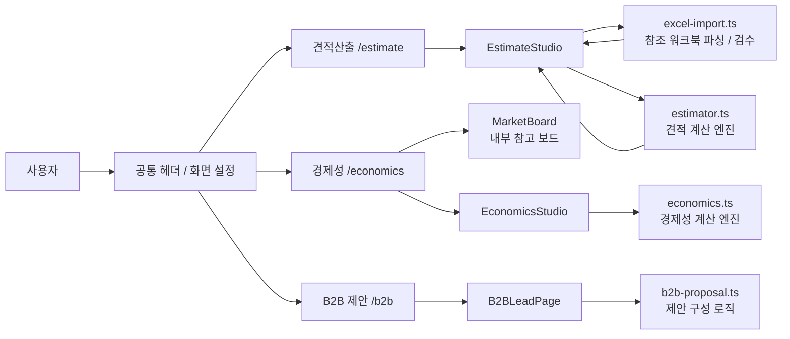
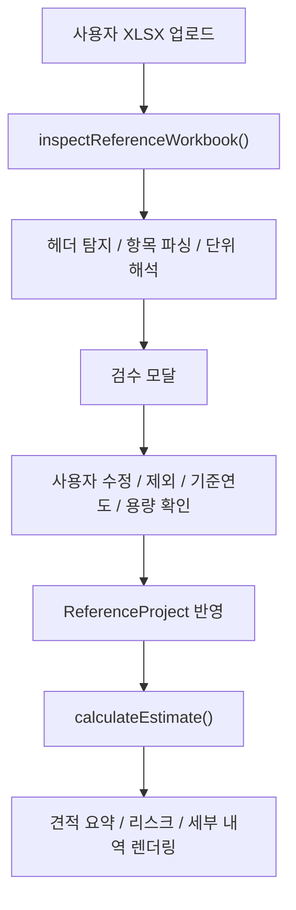

# SOFC Estimate Studio

SOFC EPC 견적산출, 경제성 검토, B2B 제안 초안을 하나의 Next.js 프로젝트에서 운영하는 내부 검토용 도구입니다.

이 프로젝트의 핵심 원칙은 세 가지입니다.

- 같은 입력이면 항상 같은 결과가 나오도록 계산을 결정론적으로 유지합니다.
- 엑셀 업로드와 계산은 로컬 코드로 처리합니다.
- 업로드 파일은 브라우저에서만 처리하고, 외부 전송 없이 내부 검토 흐름에 맞춰 운영합니다.

## 핵심 원칙

### 1. 결정론적 계산

견적산출과 경제성 계산은 LLM 응답이나 외부 서비스에 의존하지 않습니다.

- 견적산출 엔진: [lib/estimator.ts](C:/Users/jerom/OneDrive/문서/EstimationPJT/lib/estimator.ts)
- 경제성 계산 엔진: [lib/economics.ts](C:/Users/jerom/OneDrive/문서/EstimationPJT/lib/economics.ts)
- 참조 워크북 파싱/검수: [lib/excel-import.ts](C:/Users/jerom/OneDrive/문서/EstimationPJT/lib/excel-import.ts)

즉, 동일한 참조 워크북과 동일한 입력값을 넣으면 항상 같은 결과가 나옵니다.

### 2. 비정형 문서 자동 반영 금지

현재 버전은 PDF, Word 같은 비정형 문서를 자동 해석해 금액에 반영하지 않습니다.

- 문서 문장을 AI가 읽고 임의로 단가를 추정하지 않음
- 계약서나 현장조사서 내용을 자동으로 금액화하지 않음
- 사용자가 확정한 구조화 입력만 계산에 사용

이 원칙은 견적 정합성과 재현성을 위해 유지합니다.

### 3. 내부검토 기준

이 프로젝트는 업로드 파일과 계산 결과를 외부로 보내지 않는 내부 검토용 구성을 기준으로 합니다.

- 외부 AI API 호출 없음
- 외부 DB 호출 없음
- 외부 로그/분석 전송 없음
- 외부 웹폰트 CDN 호출 없음
- 지도와 참고 시세는 브라우저가 외부 원문을 직접 참조할 수 있음
- 업로드 파일 내용은 지도/시세 참조에 포함되지 않음

## 보안 및 데이터 처리

### 요약

현재 버전은 `엑셀 업로드 -> 브라우저 메모리에서 파싱 -> 로컬 계산 -> 화면 표시` 흐름으로 동작합니다.

엑셀 파일은 앱 코드 기준으로 외부 서버에 업로드되지 않습니다. 다만 지도 미리보기와 경제성 페이지의 참고 시세는 사용자의 브라우저가 외부 사이트를 직접 참조할 수 있습니다.

또한 현재는 브라우저 저장소(`localStorage`, `sessionStorage`, `indexedDB`)에도 업로드 결과를 남기지 않도록 구성되어 있습니다. 따라서 새로고침하면 업로드한 참조 엑셀, 계산 이력, 화면 설정은 모두 초기화됩니다.

### 데이터 경계

이 프로젝트에서 다루는 데이터 경계는 다음과 같습니다.

- 사용자 선택 파일: 사용자의 브라우저 메모리에서만 읽음
- 계산 중간값: React 상태와 함수 내부 값으로만 유지
- 결과 화면: 현재 세션의 DOM에만 렌더링
- 새로고침 후 상태: 유지되지 않음
- 지도/시세 참조: 서버 중계를 거치지 않고 사용자의 브라우저가 직접 조회

### 엑셀 업로드 처리 방식

참조 워크북 업로드는 다음 순서로 처리됩니다.

1. 사용자가 브라우저에서 `.xlsx`, `.xls`, `.csv` 파일을 선택
2. 브라우저가 `File` 객체를 메모리로 전달
3. [lib/excel-import.ts](C:/Users/jerom/OneDrive/문서/EstimationPJT/lib/excel-import.ts)에서 `file.arrayBuffer()`로 읽음
4. `xlsx` 라이브러리로 브라우저/앱 런타임 안에서 파싱
5. 검수 모달에서 사용자가 항목/카테고리/금액을 확인
6. 최종 확정된 구조화 데이터만 계산 엔진에 전달

추가 안전장치:

- 숨겨진 시트는 계산에서 제외하고 검수 경고로 표시
- 셀 메모/주석은 계산에 반영하지 않고 검수 경고로 표시

여기서 중요한 점은:

- 앱 코드가 업로드 파일을 외부로 전송하지 않음
- GitHub로 자동 업로드하지 않음
- 별도 서버 DB에 저장하지 않음
- 브라우저 저장소에도 남기지 않음
- 지도와 시세 참조 요청에 업로드 파일 내용이 함께 전송되지 않음

### 외부 호출 관련 현 상태

현재 외부 통신은 목적별로 아래처럼 제한되어 있습니다.

- 업로드 파일 처리/견적 계산 경로
  - 외부 호출 없음
  - 업로드 파일은 브라우저 메모리에서만 파싱
- 지도 미리보기
  - 브라우저가 외부 지도 URL을 직접 임베드
  - 서버 중계 없음
  - 업로드 파일 내용 전송 없음
- 경제성 페이지 참고 시세
  - 브라우저가 외부 원문 또는 공개 시세 API를 직접 참조
  - 서버 중계 없음
  - 업로드 파일 내용 전송 없음

즉, 업로드한 엑셀과 계산 결과를 외부로 보내는 경로는 없고, 외부 호출이 있더라도 그것은 지도/시세 화면 참조에 한정됩니다.

### 브라우저 저장소 관련 현 상태

현재 `app`, `components`, `lib` 기준으로 아래 저장소를 사용하지 않습니다.

- `localStorage`
- `sessionStorage`
- `indexedDB`

따라서 새로고침 또는 브라우저 재오픈 시 상태가 남지 않습니다.

### GitHub와의 관계

브라우저에서 엑셀 파일을 선택하는 것만으로 GitHub에 파일이 올라가지는 않습니다.

GitHub에 올라가는 것은 아래 두 조건을 모두 만족할 때뿐입니다.

1. 사용자가 해당 파일을 프로젝트 폴더 안에 직접 저장하거나 복사
2. 그 파일을 `git add -> commit -> push`

즉, 단순 업로드/계산 사용만으로는 GitHub에 엑셀 자료가 남지 않습니다.

### 내부 설득용 표현

내부 검토 문서에는 아래처럼 설명하면 됩니다.

> 본 프로그램은 업로드된 엑셀 파일을 브라우저 메모리에서만 파싱하며, 외부 AI, 외부 DB, 외부 로그 서버로 전송하지 않습니다. 지도와 참고 시세는 사용자의 브라우저가 외부 원문을 직접 참조할 수 있으나, 업로드 파일 내용은 해당 호출에 포함되지 않습니다. 또한 브라우저 저장소에도 결과를 남기지 않도록 구성되어 있어 새로고침 시 업로드 자료와 계산 결과가 초기화됩니다.

> 이 도구는 내부 검토용 계산기와 같은 방식으로 동작합니다. 브라우저에 입력한 값은 현재 세션의 메모리에서만 처리되며, 앱 코드가 이를 외부 시스템으로 업로드하거나 저장하지 않습니다.

### 실무 운영 시 틈새 리스크

앱 코드와 별도로, 사용자의 브라우저 환경과 단말 정책에서 아래 변수가 생길 수 있습니다.

#### 1. 브라우저 확장 프로그램

- AI 요약, 번역, 화면 캡처 계열 확장 프로그램은 DOM에 접근할 수 있습니다.
- 내부 검토 시에는 확장 프로그램이 차단된 시크릿 모드 사용을 권장합니다.

#### 2. 리퍼러(Referer) 노출 방지

- 지도 미리보기나 외부 시세 참조 시, 브라우저가 현재 페이지 경로를 리퍼러 헤더로 보낼 수 있습니다.
- 이 프로젝트는 [app/layout.tsx](C:/Users/jerom/OneDrive/문서/EstimationPJT/app/layout.tsx)에 `referrer=no-referrer`를 적용해 내부 경로 정보 노출을 줄입니다.

#### 3. 브라우저 메모리/비정상 종료

- 드문 경우지만 브라우저 비정상 종료 시 단말 수준의 메모리 덤프가 남을 수 있습니다.
- 민감한 검토가 끝난 뒤에는 브라우저 창만 닫지 말고 프로세스까지 완전히 종료하는 것을 권장합니다.

### 운영 시 주의사항

앱 코드 기준으로는 외부 전송이 없지만, 아래 항목은 별도 운영 정책으로 관리해야 합니다.

- 사용자가 원본 엑셀 파일을 프로젝트 폴더에 직접 복사해 넣는 경우
- 사용자가 엑셀 파일을 Git으로 직접 커밋하는 경우
- 회사 보안 에이전트, DLP, 브라우저 감사 프로그램이 별도로 파일/화면을 수집하는 경우
- 원격 데스크톱, 화면 녹화, 백업 솔루션이 별도로 동작하는 경우
- 브라우저 확장 프로그램이 화면 내용을 별도로 수집하는 경우

즉, 앱 자체의 외부 전송은 차단되어 있지만, 회사 단말 정책까지 자동으로 통제하는 것은 아닙니다.

### 권장 운영 방식

내부망에서 더 안전하게 쓰려면 아래를 권장합니다.

- 업로드 대상 원본 엑셀은 프로젝트 폴더 밖에서 선택
- 프로젝트 폴더에는 소스코드만 유지
- Git 커밋 전 `git status`로 민감 파일 포함 여부 확인
- 대표 보고/바이어 제출용 산출물은 별도 승인 후 저장
- 내부 검토 시에는 시크릿 모드 사용
- 민감 검토 후에는 브라우저 프로세스를 완전히 종료

## 페이지 구성

| 경로 | 목적 | 주요 컴포넌트 |
| --- | --- | --- |
| `/estimate` | 기준 프로젝트 기반 견적산출 | `EstimateStudio` |
| `/economics` | 투자지표 및 민감도 분석 | `EconomicsStudio` |
| `/b2b` | 영업 제안 초안 작성 | `B2BLeadPage` |

## 전체 설계도



## 견적산출 데이터 흐름



## 주요 파일 역할

### 공통 진입

- [app/layout.tsx](C:/Users/jerom/OneDrive/문서/EstimationPJT/app/layout.tsx)
  - 공통 레이아웃
  - 로컬 Pretendard 적용
  - 공통 헤더 / 화면 설정 포함
- [app/globals.css](C:/Users/jerom/OneDrive/문서/EstimationPJT/app/globals.css)
  - 전체 디자인 시스템
  - 내부 검토 / 바이어 제출 / 인쇄 스타일 포함

### 견적산출

- [app/estimate/page.tsx](C:/Users/jerom/OneDrive/문서/EstimationPJT/app/estimate/page.tsx)
  - 견적산출 페이지 래퍼
- [components/estimate-studio.tsx](C:/Users/jerom/OneDrive/문서/EstimationPJT/components/estimate-studio.tsx)
  - 견적산출 메인 UI
  - 기준 워크북 업로드
  - 검수 모달
  - 내부 검토 / 바이어 제출 모드
- [components/estimate-analytics.tsx](C:/Users/jerom/OneDrive/문서/EstimationPJT/components/estimate-analytics.tsx)
  - Monte Carlo
  - ₩/kW 벤치마크
  - 견적 이력 워터폴 비교
- [lib/excel-import.ts](C:/Users/jerom/OneDrive/문서/EstimationPJT/lib/excel-import.ts)
  - 참조 워크북 파싱
  - 헤더 탐지
  - 금액 단위 해석
  - 검수용 경고 생성
- [lib/estimator.ts](C:/Users/jerom/OneDrive/문서/EstimationPJT/lib/estimator.ts)
  - 용량 비례 환산
  - S / P / C 복리 물가상승
  - 현장 가산 / 도면 차이 / 마진 / 하자보수 계산

### 경제성

- [app/economics/page.tsx](C:/Users/jerom/OneDrive/문서/EstimationPJT/app/economics/page.tsx)
  - 경제성 페이지 래퍼
- [components/economics-studio.tsx](C:/Users/jerom/OneDrive/문서/EstimationPJT/components/economics-studio.tsx)
  - 경제성 입력/결과 UI
  - 민감도 분석
  - tornado chart
- [components/market-board.tsx](C:/Users/jerom/OneDrive/문서/EstimationPJT/components/market-board.tsx)
  - 내부 참고 보드 UI
- [lib/market-board.ts](C:/Users/jerom/OneDrive/문서/EstimationPJT/lib/market-board.ts)
  - 외부 호출 없는 내부 placeholder 데이터
- [lib/economics.ts](C:/Users/jerom/OneDrive/문서/EstimationPJT/lib/economics.ts)
  - LCOE, Project IRR, Equity IRR, DSCR, Payback 계산

### B2B 제안

- [app/b2b/page.tsx](C:/Users/jerom/OneDrive/문서/EstimationPJT/app/b2b/page.tsx)
  - B2B 제안 페이지 래퍼
- [components/b2b-lead-page.tsx](C:/Users/jerom/OneDrive/문서/EstimationPJT/components/b2b-lead-page.tsx)
  - 제안 입력/출력 UI
- [lib/b2b-proposal.ts](C:/Users/jerom/OneDrive/문서/EstimationPJT/lib/b2b-proposal.ts)
  - 제안 문안 구성 로직

### 공통 UI

- [components/site-header.tsx](C:/Users/jerom/OneDrive/문서/EstimationPJT/components/site-header.tsx)
  - 상단 탭 네비게이션
- [components/display-config.tsx](C:/Users/jerom/OneDrive/문서/EstimationPJT/components/display-config.tsx)
  - 폰트 크기 / 글자 대비 설정
  - 현재 세션 메모리에서만 동작

## 실행

```bash
npm install
npm run dev
```

기본 접속:

- `http://127.0.0.1:3000/estimate`
- `http://127.0.0.1:3000/economics`
- `http://127.0.0.1:3000/b2b`

## 운영 문서

- [AGENTS.md](C:/Users/jerom/OneDrive/문서/EstimationPJT/AGENTS.md)
- [specs/README.md](C:/Users/jerom/OneDrive/문서/EstimationPJT/specs/README.md)
- [specs/cost-db-rules.md](C:/Users/jerom/OneDrive/문서/EstimationPJT/specs/cost-db-rules.md)
- [specs/reference-workbook-inspection.md](C:/Users/jerom/OneDrive/문서/EstimationPJT/specs/reference-workbook-inspection.md)
- [specs/estimate-calculation-rules.md](C:/Users/jerom/OneDrive/문서/EstimationPJT/specs/estimate-calculation-rules.md)
- [specs/change-checklist.md](C:/Users/jerom/OneDrive/문서/EstimationPJT/specs/change-checklist.md)
