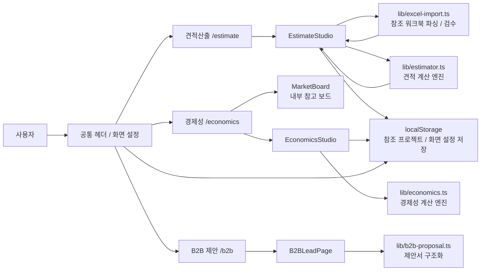

# SOFC Estimate Studio

SOFC EPC 견적산출, 경제성 분석, B2B 제안 초안을 하나의 Next.js 프로젝트에서 운영하는 내부 검토용 앱입니다.

현재 기준 원칙은 명확합니다.

- 같은 입력이면 항상 같은 결과가 나와야 한다.
- 최종 견적 계산은 로컬 계산식으로만 처리한다.
- 엑셀 업로드 데이터는 외부로 전송하지 않는다.
- 비정형 문서는 있어도 자동으로 금액에 반영하지 않는다.

## 핵심 정책

### 1. 결정론적 계산 우선

이 프로젝트의 견적산출과 경제성 계산은 LLM 추론이 아니라 결정론적 로컬 함수로 처리합니다.

- 견적산출: `lib/estimator.ts`
- 경제성 분석: `lib/economics.ts`
- 엑셀 파싱/검수: `lib/excel-import.ts`

즉, 동일한 참조 워크북과 동일한 입력값을 넣으면 항상 같은 결과가 나와야 합니다.

### 2. 비정형 문서 자동 반영 금지

PDF, Word, 현장조사서, 계약서 같은 비정형 문서는 나중에 참고자료로 붙일 수는 있지만, 현재 정책은 다음과 같습니다.

- 문서의 문장을 AI가 읽더라도 바로 견적 금액에 넣지 않는다.
- 문서 해석이 필요하면 `후보 항목 추출`까지만 허용한다.
- 최종 반영은 사용자가 수량, 단가, 반영 여부를 확정한 뒤에만 가능하다.

한 줄로 정리하면 다음과 같습니다.

> AI는 제안만 할 수 있고, 계산은 확정된 구조화 입력으로만 한다.

### 3. 내부망 전용 운영

현재 앱은 내부망 운영을 기준으로 외부 의존성을 최대한 제거했습니다.

- 엑셀 업로드: 로컬 파싱만 수행
- 외부 AI API: 사용 안 함
- 외부 시세 API: 사용 안 함
- 외부 지도: 사용 안 함
- 폰트: 로컬 파일 사용

따라서 현재 기준으로는 엑셀 업로드 시 파일 내용이 외부로 나가지 않습니다.

## 페이지 구성

| 경로 | 목적 | 핵심 컴포넌트 |
| --- | --- | --- |
| `/estimate` | 기준 프로젝트 기반 견적산출 | `EstimateStudio` |
| `/economics` | 투자지표, 민감도, 시나리오 분석 | `EconomicsStudio` |
| `/b2b` | 영업 제안 초안 작성 | `B2BLeadPage` |

## 전체 설계도



## 견적산출 데이터 흐름


## 주요 파일 역할

### 앱 진입

- `app/layout.tsx`
  - 공통 레이아웃
  - 로컬 Pretendard 적용
  - 공통 헤더 / 화면 설정 버튼 포함
- `app/globals.css`
  - 전체 디자인 시스템
  - 내부 검토 / 바이어 제출 / 인쇄용 스타일 포함

### 견적산출

- `app/estimate/page.tsx`
  - 견적산출 페이지 래퍼
- `components/estimate-studio.tsx`
  - 견적산출 메인 UI
  - 기준 워크북 업로드
  - 검수 모달
  - 입력 접기/펼치기
  - 내부 검토 / 바이어 제출 모드
- `lib/excel-import.ts`
  - 참조 워크북 파싱
  - 헤더 탐지
  - 금액 단위 해석
  - 검수 요약 / 경고 생성
- `lib/estimator.ts`
  - 기준 프로젝트 스케일링
  - S / P / C 복리 물가상승
  - 현장 가산
  - 도면 차이 가산
  - 마진 / 하자보수 / 리스크 계산

### 경제성

- `app/economics/page.tsx`
  - 경제성 페이지 래퍼
- `components/economics-studio.tsx`
  - 경제성 입력 및 결과 UI
  - 민감도 분석
  - tornado chart
  - worst / base / best 시나리오
- `components/market-board.tsx`
  - 내부 참고 보드 UI
- `lib/market-board.ts`
  - 외부 호출 없는 내부 placeholder 데이터
- `lib/economics.ts`
  - LCOE, Project IRR, Equity IRR, DSCR, Payback 계산

### B2B 제안

- `app/b2b/page.tsx`
  - B2B 제안 페이지 래퍼
- `components/b2b-lead-page.tsx`
  - 제안서 UI
- `lib/b2b-proposal.ts`
  - 제안 항목 구조화 로직

### 공통 UI

- `components/site-header.tsx`
  - 상단 탭 네비게이션
- `components/display-config.tsx`
  - 폰트 크기 / 글자 대비 설정
  - localStorage 저장

## 사용자 설정 저장

브라우저 `localStorage`를 사용합니다.

- 참조 프로젝트 라이브러리
- 화면 설정
  - 폰트 크기
  - 글자 대비

서버 DB는 사용하지 않습니다.

## 실행

```bash
npm install
npm run dev
```

기본 접속:

- `http://127.0.0.1:3000/estimate`
- `http://127.0.0.1:3000/economics`
- `http://127.0.0.1:3000/b2b`

## 향후 확장 방향

- 사내 원가 DB 연동
- 사내 시세 입력 API 연동
- PDF/Word 현장조사서 후보 항목 추출
- 결과 저장 이력 관리
- 내부 결재용 보고서 출력 포맷 강화

## 운영 문서

- [AGENTS.md](C:/Users/jerom/OneDrive/문서/EstimationPJT/AGENTS.md)
- [specs/README.md](C:/Users/jerom/OneDrive/문서/EstimationPJT/specs/README.md)
- [specs/cost-db-rules.md](C:/Users/jerom/OneDrive/문서/EstimationPJT/specs/cost-db-rules.md)
- [specs/reference-workbook-inspection.md](C:/Users/jerom/OneDrive/문서/EstimationPJT/specs/reference-workbook-inspection.md)
- [specs/estimate-calculation-rules.md](C:/Users/jerom/OneDrive/문서/EstimationPJT/specs/estimate-calculation-rules.md)
- [specs/change-checklist.md](C:/Users/jerom/OneDrive/문서/EstimationPJT/specs/change-checklist.md)
